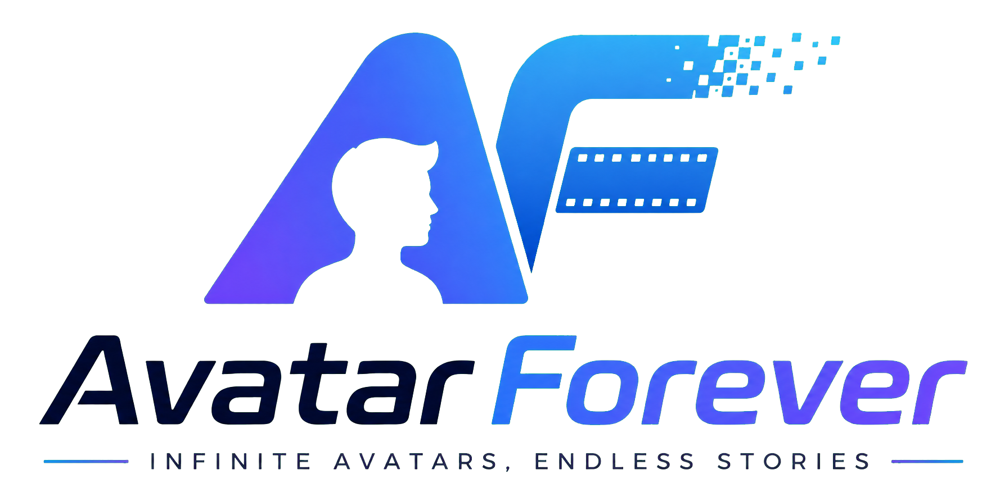
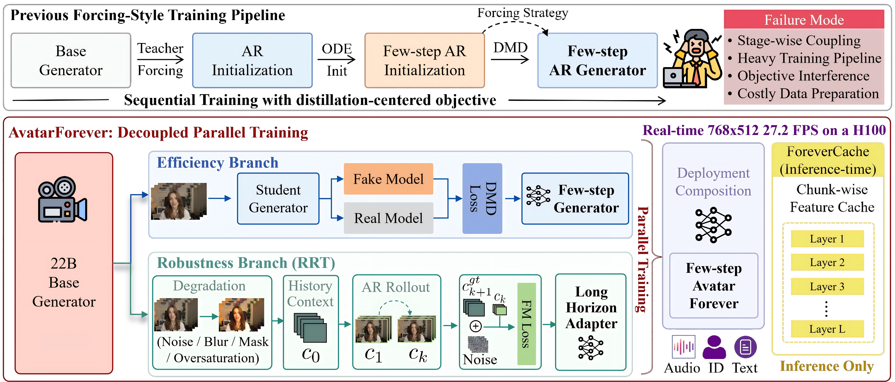

<div align="center">



### Decoupled Parallel Training for High-Quality Real-Time Infinite Avatars

**Real-time · Long-horizon · Audio-driven · 27.2 FPS at 768 × 512 on one H100**

Ruibin Li<sup>1,†</sup> · Tao Yang<sup>2</sup> · Zhiyuan Ma<sup>1</sup> · Fangzhou Ai<sup>3</sup> · Shilei Wen<sup>2</sup> · Lei Zhang<sup>1,*</sup>

<sup>1</sup> The Hong Kong Polytechnic University · <sup>2</sup> ByteDance · <sup>3</sup> AMD

<p>
  <a href="https://leeruibin.github.io/avatarforever-project-page/"><strong>Project Page</strong></a>
  ·
  <a href="https://github.com/leeruibin/avatarforever"><strong>Code Repository</strong></a>
  ·
  <a href="https://arxiv.org/abs/2608.12107"><strong>Paper</strong></a>
</p>

</div>

<sub><sup>†</sup> Work done during an internship at ByteDance. <sup>*</sup> Corresponding author.</sub>

> **Research preview.** The paper, code, models, and demos are being prepared for public release.

## Release Status

- [x] Method overview
- [x] Paper and supplementary material
- [ ] Inference code
- [ ] Model checkpoints
- [ ] Interactive demo

## Highlights

| Capability | Result |
|---|---:|
| Video resolution | 768 × 512 |
| End-to-end throughput | **27.2 FPS** |
| Hardware | **1× NVIDIA H100** |
| Backbone | 22B video foundation model |
| ForeverCache speedup | **23%** |
| Generation horizon | Effectively unbounded streaming |

End-to-end throughput includes both DiT inference and VAE decoding.

## Overview

Avatar-Forever is a framework for high-quality, real-time, and effectively unbounded audio-driven avatar generation. It addresses a central limitation of existing streaming video systems: sequential distillation pipelines entangle few-step efficiency with long-horizon robustness, so distribution shifts and optimization failures introduced early in training propagate to later stages.

Our key insight is to learn these capabilities independently and compose them only at deployment:

- **Efficiency branch:** full-parameter distribution matching distillation trains a high-quality few-step generator.
- **Robustness branch:** a lightweight long-horizon adapter is trained with **Recovery-oriented Rollout Training (RRT)** under accumulated autoregressive errors.
- **Streaming inference:** **ForeverCache** reuses stable historical features across denoising steps to avoid redundant context computation.



## Why Avatar-Forever?

Streaming avatar generation must satisfy two objectives that operate on different temporal scales:

1. **Few-step efficiency** preserves visual quality while reducing the number of denoising steps.
2. **Long-horizon robustness** prevents identity drift, motion degradation, and error accumulation over recursive rollouts.

Optimizing both objectives inside one sequential distillation pipeline creates stage-wise dependence and objective interference. Avatar-Forever instead trains them in parallel, making the training process simpler to optimize, diagnose, and scale.

## Method

### Decoupled Parallel Training

Starting from a 22B video foundation model, Avatar-Forever separates efficient generation from long-horizon adaptation. The resulting robustness adapter is merged with the distilled few-step generator at deployment.

### Recovery-oriented Rollout Training

RRT targets the error-propagation pattern encountered during streaming inference. It perturbs an early historical context, rolls the degradation forward through multiple autoregressive chunks, and applies standard flow-matching supervision after errors have accumulated. The model therefore learns to recover under long-horizon inference conditions rather than only reconstruct locally corrupted inputs.

### ForeverCache

ForeverCache is a chunk-wise history feature cache for streaming diffusion inference. It populates historical context features on the first denoising step of each chunk, then reuses those stable features while forwarding only the current chunk tokens in subsequent steps.

## Citation
If you find the method useful, please cite
```
@article{li2026avatarForever,
  title={Avatar-Forever: Decoupled Parallel Training for High-Quality Real-Time Infinite Avatars},
  author={Li, Ruibin and Yang, tao and Ma, Zhiyuan and Ai, Fangzhou and Wen, shilei and Zhang, Lei},
  journal={arXiv preprint arXiv:2608.12107},
  year={2026}
}
```
